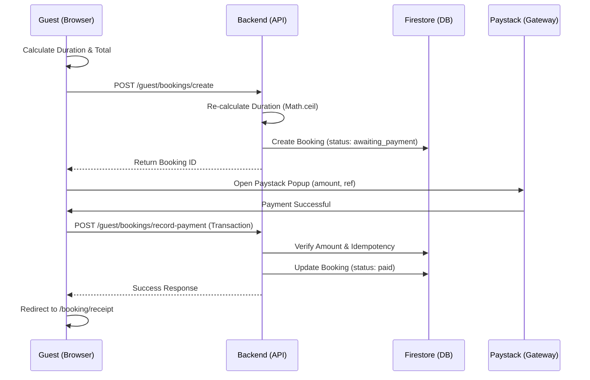
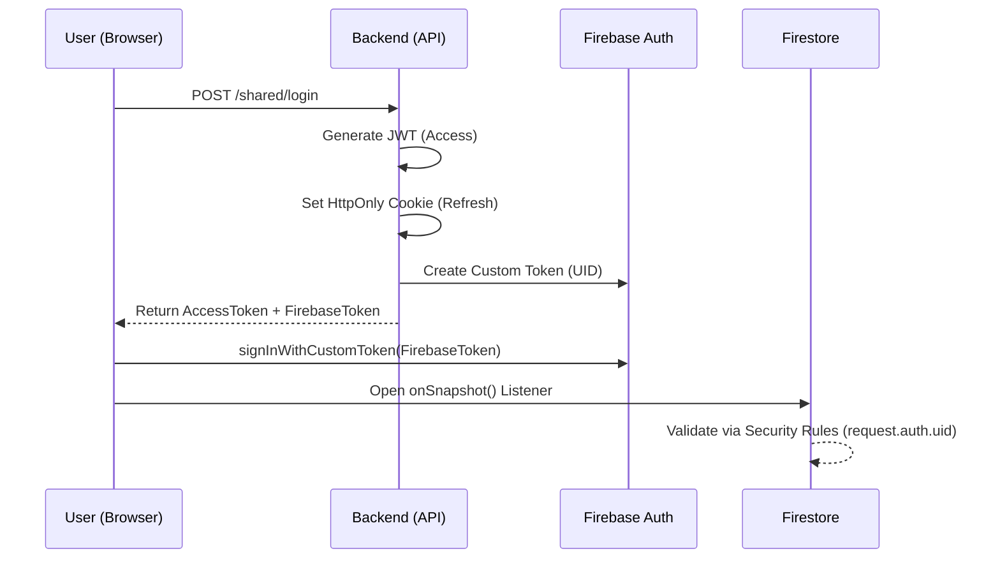
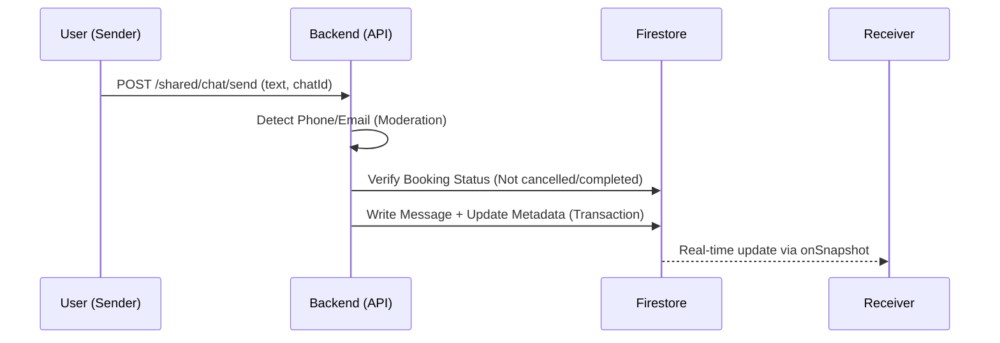
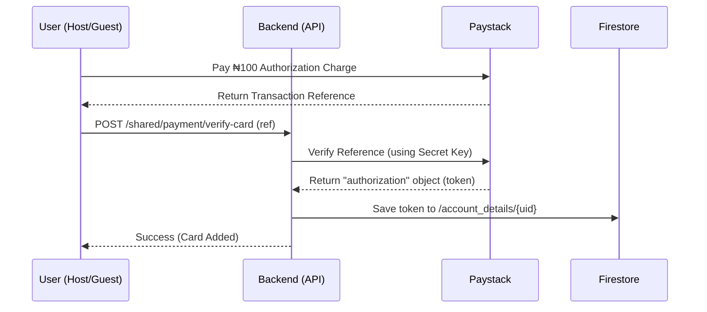

# 🌊 Data & Business Flows

This document explains the core data lifecycles within RideCity Rentals, helping new developers understand how the Frontend, Backend, and Third-Party Services (Paystack, Firestore) interact.

---

## 1. The Booking & Payment Flow
This is the most critical flow in the system, involving guest discovery, transaction processing, and record finalization.

### Key Logic:
1. **Idempotency**: The `/record-payment` endpoint uses Firestore Transactions to ensure a booking is never processed twice (webhook replay protection).
2. **Amount Verification**: The Backend re-verifies the Paystack payment amount against the `totalPayment` stored in the database.
3. **Recording**: The booking is created *before* payment to ensure we have a record if the user closes their browser mid-payment.

---

## 2. Authentication, Refresh & Auth Sync
How we manage secure sessions and real-time database access without exposing credentials.

### Key Logic:
- **JWT Rotation**: Access tokens are short-lived. The `apiClient.ts` interceptor automatically uses the HttpOnly refresh cookie to get a new token when a `401` is received.
- **Auth Sync**: The `firebaseToken` synchronizes our custom backend identity with the Firebase SDK, allowing us to use **Participant-Only** security rules in Firestore.

---

## 3. Moderated Chat Flow
How we prevent revenue leakage and protect users from off-platform scams.

### Key Logic:
- **Moderation**: Messages containing contact info are rejected with a warning.
- **Lifecycle Locking**: Once a trip is `cancelled` or `completed`, the API blocks all new messages for that `bookingId`.
- **Atomic Metadata**: Unread counts and "Last Message" are updated in the same transaction as the message itself.

---

## 4. Card Tokenization (Save Card) Flow
How we securely store payment methods without ever touching sensitive card data.

### Key Logic:
- **Authorization Charge**: A small ₦100 transaction is required by Paystack to generate a reusable "authorization" token.
- **Security**: The Frontend never sees the token; it only sends the reference. The Backend retrieves the token using the `Secret Key` server-to-server.

---

## 5. Host Earnings Logic
1. **Host Input**: Sets `dailyRate`.
2. **Backend Config**: Fetches `rentalFee` (e.g., 15%) from `admin/fees`.
3. **Calculation**:
   - `totalPayment` = `dailyRate` * `days`
   - `transactionFee` = `totalPayment` * (`rentalFee` / 100)
   - `ownerBalance` = `totalPayment` - `transactionFee`
4. **Storage**: Both the total and the host's net share are stored in the `bookings` document under `hostMeta`.

---

© 2026 RideCity Rentals. All rights reserved.
