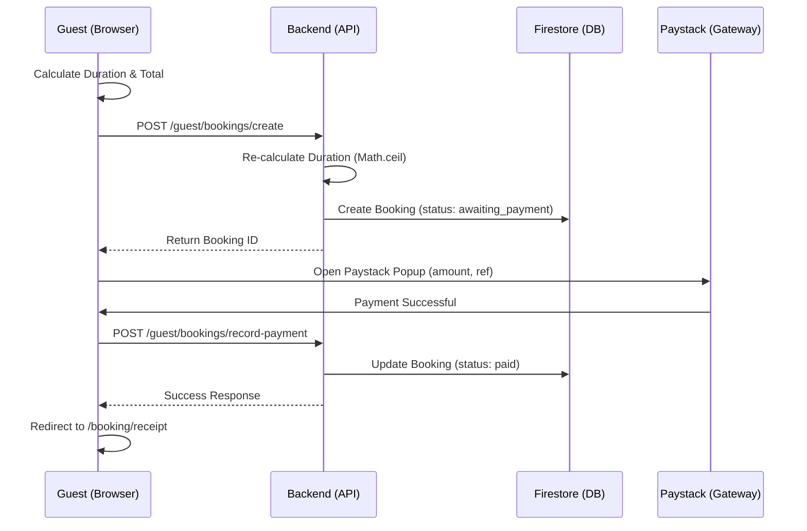
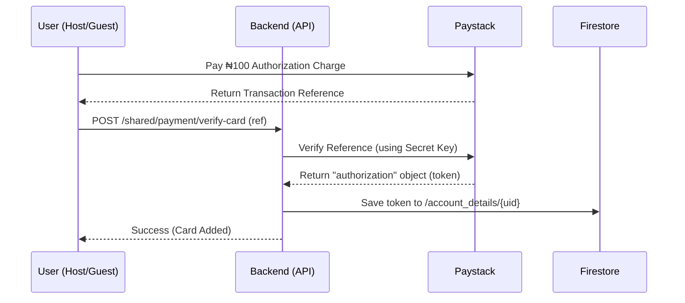
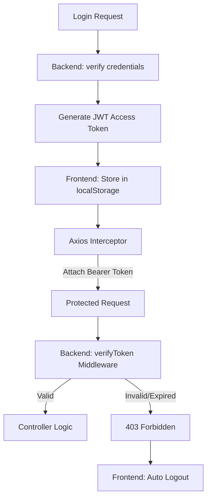

# 🌊 Data & Business Flows

This document explains the core data lifecycles within RideCity Rentals, helping new developers understand how the Frontend, Backend, and Third-Party Services (Paystack, Firestore) interact.

---

## 1. The Booking & Payment Flow
This is the most critical flow in the system, involving guest discovery, transaction processing, and record finalization.

### Key Logic:
1. **Duration Calculation**: Both Frontend and Backend must align on `Math.ceil((dropOff - pickUp) / msPerDay)`.
2. **Deterministic ID**: The Backend generates a unique booking ID based on `guestId`, `carId`, and `date` to prevent duplicate submissions.
3. **Recording**: The booking is created *before* payment to ensure we have a record if the user closes their browser mid-payment.

---

## 2. Card Tokenization (Save Card) Flow
How we securely store payment methods without ever touching sensitive card data.

### Key Logic:
- **Authorization Charge**: A small ₦100 transaction is required by Paystack to generate a reusable "authorization" token.
- **Security**: The Frontend never sees the token; it only sends the reference. The Backend retrieves the token using the `Secret Key` server-to-server.

---

## 3. Authentication & API Security
How we protect private routes.

### Key Logic:
- **apiClient.ts**: A centralized Axios instance that automatically attaches the `Authorization` header to every outgoing request.
- **Response Interceptor**: Automatically detects `401/403` errors from the API and triggers a Redux `logout()` to keep the UI in sync.

---

## 4. Host Earnings Logic
1. **Host Input**: Sets `dailyRate`.
2. **Backend Config**: Fetches `rentalFee` (e.g., 15%) from `admin/fees`.
3. **Calculation**:
   - `totalPayment` = `dailyRate` * `days`
   - `transactionFee` = `totalPayment` * (`rentalFee` / 100)
   - `ownerBalance` = `totalPayment` - `transactionFee`
4. **Storage**: Both the total and the host's net share are stored in the `bookings` document under `hostMeta`.

---

© 2026 RideCity Rentals. All rights reserved.
